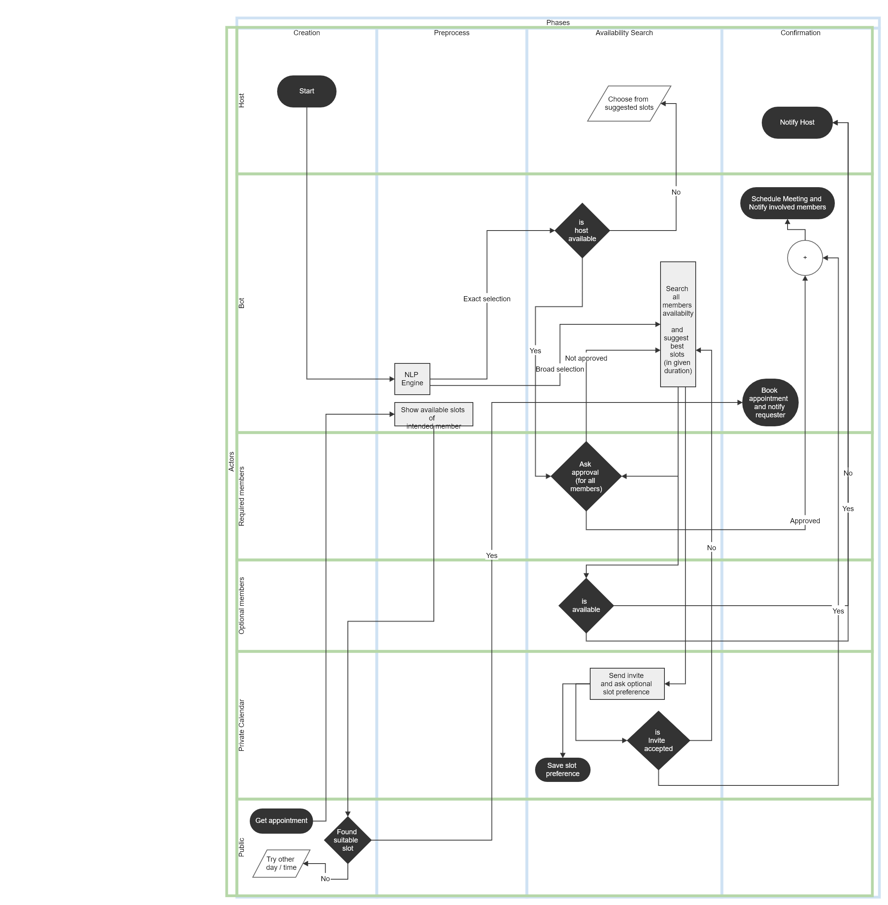

# calenapi
Scheduling Bot backend using Django Rest Framework


## Installation

* Clone the repo
```
git clone https://github.com/shivampip/calenapi.git
cd calenapi
```

* Installing dependancies
```
pip install -r requirements.txt
```

## Run

* Run server
```
python manage.py runserver
```

* Once server starts running, Browse at **http://localhost:8000/home/**
* Note: since its just backend, gui is not good. and gui is not available for all actions.


## API Documentation

| Action  | Request type |  URL  |  arguments  | response | Authentication |
| ------------- | ------------- | ------------- | ------------- | ------------- | ------------- |
| Signup  | POST  | http://localhost:8000/calen/register/  |  username, password  | username  | False |
| Get Auth Token  | POST  | http://localhost:8000/calen/get_token/  |  username, password  | auth-token  | False |
| Verify  | POST  | http://localhost:8000/calen/verify/  |  None  | html  | True |
| Make Busy Slot  | POST  | http://localhost:8000/calen/make_busy_slots/  |  title, week_day, start_time, end_time  | html  | True |
| GET Busy Slot  | GET  | http://localhost:8000/calen/get_busy_slots/  |  None  | html  | True |
| Make AutoApprove Slot  | POST  | http://localhost:8000/calen/make_aa_slots/  |  title, week_day, start_time, end_time  | html  | True |
| GET AutoApprove Slot  | GET  | http://localhost:8000/calen/get_aa_slots/  |  None  | html  | True |
| Create Pending Event  | POST  | http://localhost:8000/calen/make_pending_event/  |  title, date_start, date_end, members, include_author  | Ack  | True |
| Pending Event Status  | GET  | http://localhost:8000/calen/show_pending_event_status/  |  None  | All pending events status  | True |
| Show Invites  | GET  | http://localhost:8000/calen/show_invites/  |  None  | Invite list  | True |
| Accept Invite  | POST  | http://localhost:8000/calen/accept_invite/  |  id  | Ack  | True |
| Get Available Slots  | POST  | http://localhost:8000/calen/get_available_slots/  |  start_date, end_date, duration  | status, all available slots  | True |
| List Event  | GET  | http://localhost:8000/calen/list_events/  |  None  | Event list  | True |

Detailed formats will be provided, once its completed.

## Progress

*  [](https://shields.io/)
*  [](https://shields.io/)
*  [](https://shields.io/)
*  [](https://shields.io/)


## Diagram


